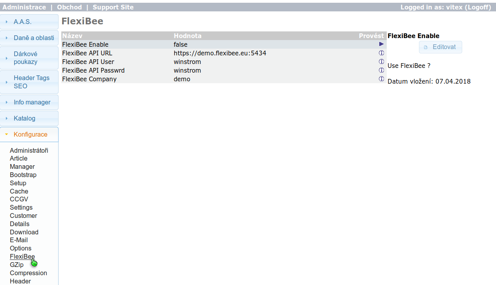

#install debian

## 1. install requirements

### add repo keys for php-phinx

    wget -O - http://v.s.cz/info@vitexsoftware.cz.gpg.key | sudo apt-key add -
    echo deb http://v.s.cz/ stable main | sudo tee /etc/apt/sources.list.d/vitexsoftware.list
    sudo apt update
### install packages

apt install php7.2 php7.2-mysql php7.2-dom php7.2-mbstring php-phinx php7.2-gd php7.2-xml

#2. clone repo

git clone https://github.com/SimonFormanek/pureosc.git

##create config files and fill details
cp -r oscconfig.dist ../

###configure:

#### configure.php

#### admin/configure.php

#### static.php

#### dbconfigure.php

###rename and fill MySQL connection details
  cp phinx.yml.dist phinx.yml
  cp Makefile.dist Makefile

### install
Make fresh

## Optional configuration

### Flexibee

## GP Webpay

## PayPal

